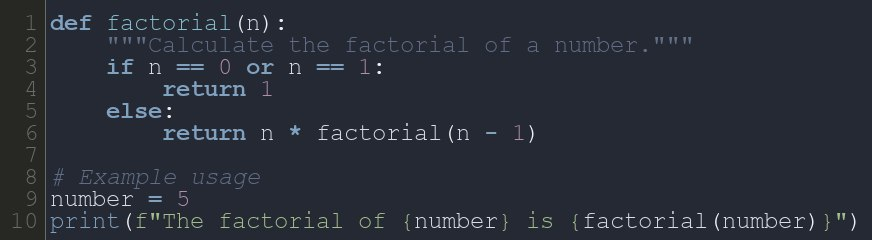

# CodeSnap-bot

A Telegram bot that converts code snippets into beautifully formatted images with syntax highlighting. Perfect for sharing code in an elegant way!

## Features

- Syntax highlighting for various programming languages.
- Multiple color themes for image styling (default: `nord-darker`).
- Line numbers with customizable background and foreground colors.
- Supports direct messages and group mentions.
- Processes code blocks in replies or messages with `pre` tags.

## Requirements

This bot requires the following Python libraries:

- [pyTelegramBotAPI](https://pypi.org/project/pyTelegramBotAPI)
- [Pygments](https://pypi.org/project/Pygments/)
- [Pillow](https://pypi.org/project/Pillow/)

Install all dependencies with:

```bash
pip install -r requirements.txt
```

## Installation

1. Clone this repository:
    ```bash
    git clone https://github.com/AbolDev/CodeSnap-bot.git
    cd CodeSnap-bot
    ```

2. Install the dependencies:
    ```bash
    pip install -r requirements.txt
    ```

3. Create a `config.py` file with your bot's token:
    ```python
    # config.py
    TOKEN = 'YOUR_BOT_TOKEN_HERE'
    ```

4. Run the bot:
    ```bash
    python bot.py
    ```

5. The bot will start running and listening for messages.

## Usage

1. **Start the Bot:** Send the `/start` command to the bot.
2. **Send Code:** 
   - Directly send a code snippet.
   - Reply to a message containing a code block.
   - Mention the bot in a group and include the code snippet.

The bot will process the code and reply with a syntax-highlighted image.

## Example Themes

You can switch the theme in the `generate_code_image` function. Some available themes:
- `dracula`
- `github-dark`
- `gruvbox-dark`
- `monokai`
- `nord-darker`
- `one-dark`
- `solarized-dark`
- `paraiso-dark`

## Example Screenshot



## License

This project is licensed under the MIT License. See the [LICENSE](LICENSE) file for details.

## Contributing

Contributions are welcome! Feel free to open issues or submit pull requests for improvements or bug fixes.

## Support

If you encounter any issues or have questions, please open an issue in the GitHub repository or contact me directly.

---
Happy coding! 🚀
